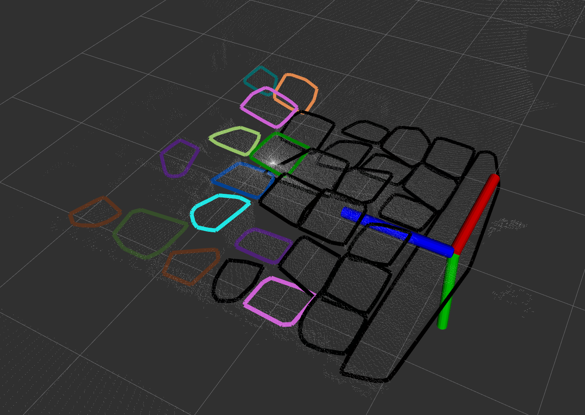
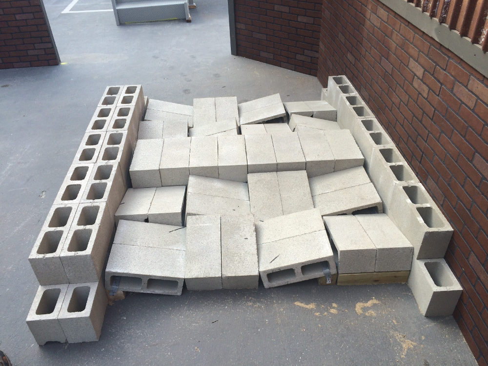

# Plane Seg

[](https://www.youtube.com/watch?v=YYs4lJ9t-Xo)

*Plane Seg* is a library for fitting planes to LIDAR, depth camera data or elevation maps. It uses robust estimation to fit planes by clustering planar points with similar normals.

We assume the ROS build system (e.g. Melodic). The core library (plane-seg) is only dependent on PCL. The ROS application (plane-seg-ros) can process PointCloud2 and GridMap data types.

# Using It

**Run-Time Application:** A sample application (for ANYmal) can be run and visualized (in Rviz) as follows:

```python
roslaunch plane_seg_ros anymal.launch
roslaunch plane_seg_ros view_plane_seg.launch
```

**Test program:** reads example point clouds (PCDs), processes them and executes the fitting algorithm:

```python
roslaunch plane_seg_ros test.launch
roslaunch plane_seg_ros view_plane_seg.launch
```


# Input

Input should be a point cloud or elevation map in the robot's odometry frame as well as the pose of the robot
in the odometry frame. The elevation map is assumed to be at a 1-2 Hz.

# Output

A series of planar convex hulls published to ROS at 1-2 Hz

* Nov 2019: Existing limitation is that the code searches for plane regions (which works fine), but that these regions are then assumed to be convex. However, they could be concave. We need to instead break concave regions into convex ones - a basic task.

# Performance

* The ANYmal RGB-D (RealSense D435) elevation map is 2cm resolution with 18000 points. It takes 0.3 seconds to process.
* The DRC LIDAR terrain scan below is very dense with 76000 points. It takes 2.5 seconds to process.

# Authors

Originally Developed as part of the DARPA Robotics Challenge project at MIT. Subsequent improvements and conversion to ROS was carried out at the DRS Group in Oxford during the MEMMO EU H2020 Project.

**Maintainers: DRS Group at Oxford Robotics Institute<br />
Original Author: Matt Antone (then at MIT)**

The source code is released under a [BSD 3-Clause license](LICENSE).

## Citing this work

If you use this work in an academic context, please use the following:

* M. Fallon, M. Antone,
**"Plane Seg – Robustly and Efficiently Extracting Contact Regions from Depth Data"**.


        @misc{Fallon2019PlaneSeg,
            author = {Fallon, Maurice and Antone, Matt},
            url = {https://github.com/ori-drs/plane_seg},
            title = {{Plane Seg – Robustly and Efficiently Extracting Contact Regions from Depth Data}},
            year = {2019},
        }

# Other Images

Segmenting the DARPA Robotics Challenge terrain:



Actual DRC Finals terrain (not quite the same scene):



Video of ANYmal climbing a simulated staircase in Gazebo:

[](https://www.youtube.com/watch?v=oXMB14HaFns)
